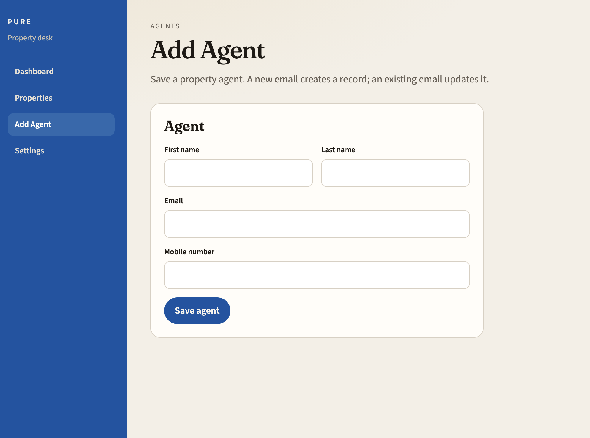
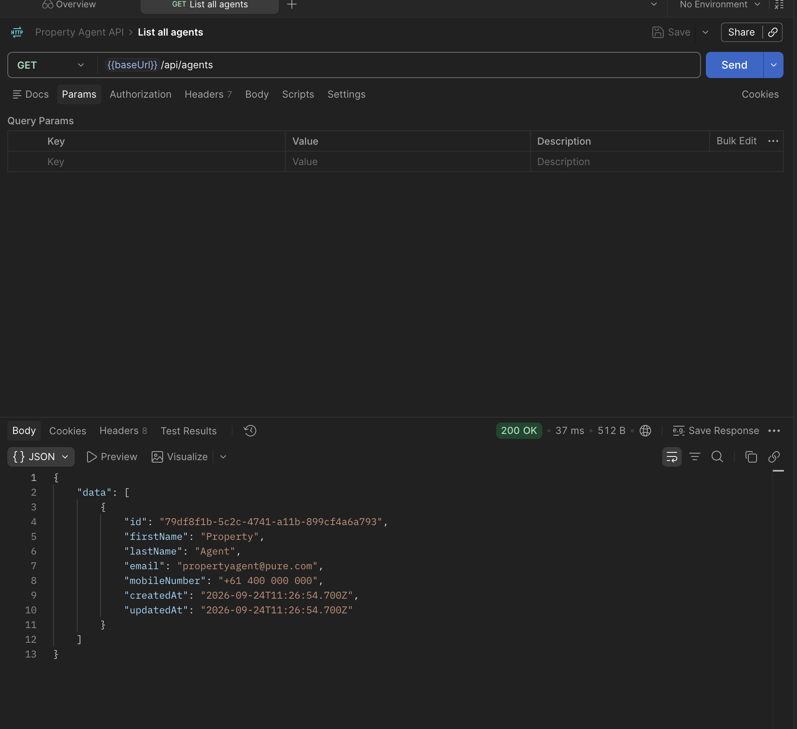
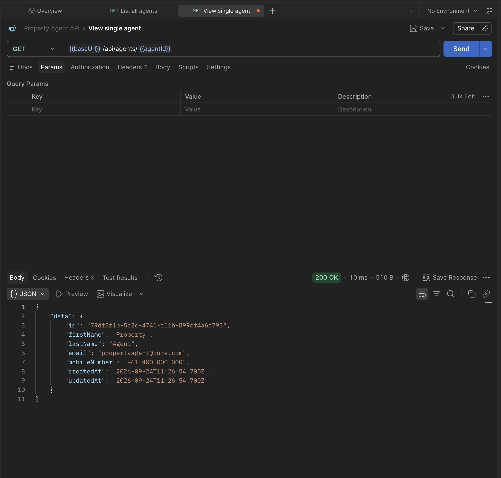
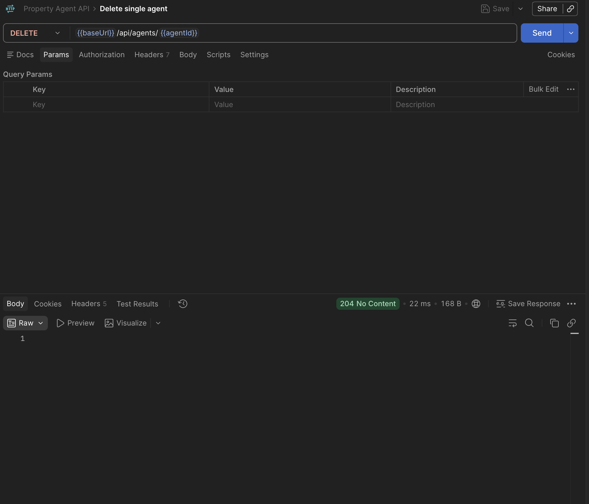
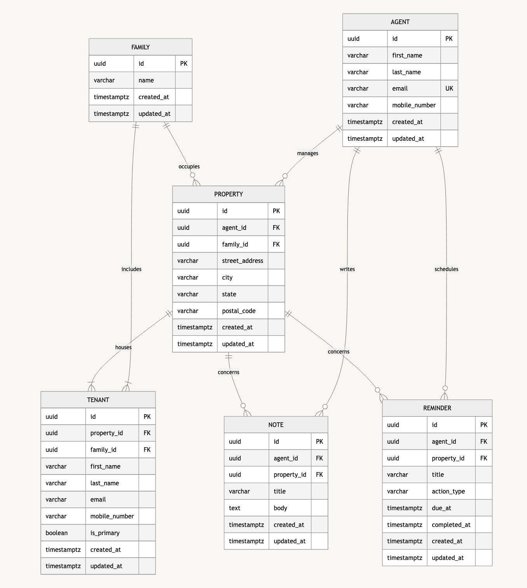

# PURE - Property Agent Desk

Full-stack exercise: a property agent manages rental properties, each occupied by one family with one or more tenants. Agents keep notes and reminders for work such as maintenance and pest control.

The required brief is **in-memory Agent CRUD** plus a Vue upsert form. The running API also serves seeded properties, notes, and reminders. There is no database. The backend is **Node.js, Express, and TypeScript**. The web client is **Vue 3 and TypeScript**.

## Run it

Needs Node.js 18 or newer. Use two terminals.

```bash
cd server
npm install
npm start
```
ScreenshotsAPI
```bash
cd client
npm install
npm run dev
```

- API: [http://localhost:3000](http://localhost:3000)
- Vue form: [http://localhost:5173](http://localhost:5173)

The Vite dev server proxies `/api` to port 3000.

```bash
cd server
npm test
```

## Screenshots



### List all agents

`GET /api/agents`



### View a single agent

`GET /api/agents/:id`



### Delete a single agent

`DELETE /api/agents/:id`



## Vue client

The dashboard shows the current seed agent. Properties lists the agent’s rentals, each with one family, tenants, notes, and reminders. Add Agent upserts by email (`PUT /api/agents`) and stays on the form. Settings updates the current agent by id.

- Dashboard: [http://localhost:5173](http://localhost:5173)
- Properties: [http://localhost:5173/properties](http://localhost:5173/properties)
- Add Agent: [http://localhost:5173/agents/new](http://localhost:5173/agents/new)
- Settings: [http://localhost:5173/settings](http://localhost:5173/settings)

## Stretch goal

**Email uniqueness and payload validation on the server.**

The brief did not ask for uniqueness or format checks. They are included because an agent’s email is the natural business key: without a unique constraint you can create duplicate people, and without validation the store will accept unusable records.

What was added:

- Unique email (`409 DUPLICATE_EMAIL`)
- Format checks for email and mobile (`400 VALIDATION_ERROR` with field details)
- Upsert-by-email so the form can create or update without the user first looking up an id

## Error handling (for the session)

Both layers should participate, for different reasons.

**Backend (source of truth)**

- Reject invalid or incomplete payloads.
- Enforce unique email.
- Return stable error codes and HTTP status values (`400`, `404`, `409`).
- Never trust the client. The API can be called from Postman, curl, or another app.

**Frontend (experience)**

- Required attributes and basic format checks so the user gets immediate feedback.
- Show the server’s message and field details when a request fails.
- Do not be the only place validation lives. A user can bypass the form.

A practical split: the form prevents obvious mistakes; the API remains the last and authoritative check.

## Data model in brief



- `agents` 1 - * `properties`
- `families` 1 - * `properties` (one family occupies a property)
- `properties` 1 - * `tenants` (at least one; all from that family)
- `agents` 1 - * `notes` and `reminders`, each tied to a property

Full tables, keys, and delete rules: [`docs/data-model.md`](docs/data-model.md).
