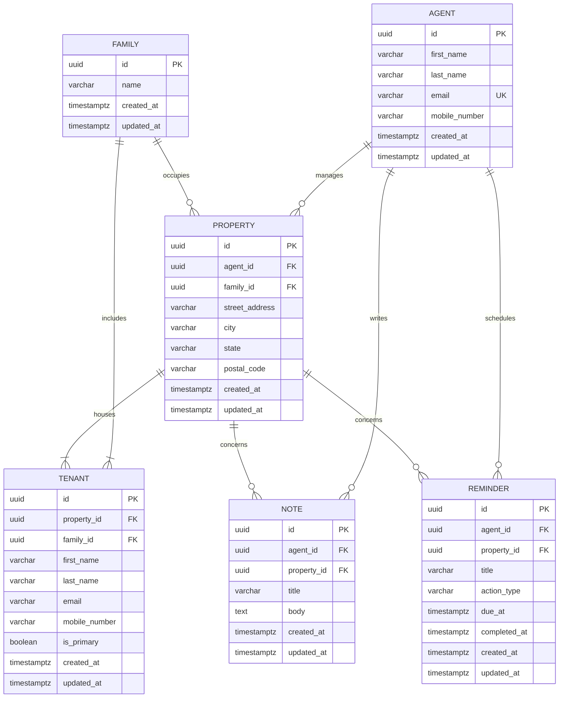

# Relational Data Model

A property agent manages many rental properties. Each property is occupied by **exactly one family** and has **one or more tenants**, all from that family. The agent keeps personal notes and reminders so they can carry out work on a property (maintenance, pest control, inspections, and so on).

This is the logical schema the application is designed around. The REST API persists **agents and properties** in memory, including families, tenants, notes, and reminders. There is no SQL database; constraints below describe the intended relational design. What the in-memory store actually enforces is listed under [Implementation notes](#implementation-notes).

## Entity-Relationship Diagram



A rendered diagram is also available at [`data-model.html`](./data-model.html) (open it in a browser).

## Tables, Columns, and Constraints

### `agents`

The person who manages rental properties.

| Column | Type | Constraints |
| --- | --- | --- |
| `id` | `UUID` | Primary key |
| `first_name` | `VARCHAR(100)` | `NOT NULL` |
| `last_name` | `VARCHAR(100)` | `NOT NULL` |
| `email` | `VARCHAR(255)` | `NOT NULL`, `UNIQUE` |
| `mobile_number` | `VARCHAR(20)` | `NOT NULL` |
| `created_at` | `TIMESTAMPTZ` | `NOT NULL`, default `now()` |
| `updated_at` | `TIMESTAMPTZ` | `NOT NULL`, default `now()` |

### `families`

A household. All tenants of a property belong to one family.

| Column | Type | Constraints |
| --- | --- | --- |
| `id` | `UUID` | Primary key |
| `name` | `VARCHAR(150)` | `NOT NULL` |
| `created_at` | `TIMESTAMPTZ` | `NOT NULL`, default `now()` |
| `updated_at` | `TIMESTAMPTZ` | `NOT NULL`, default `now()` |

### `properties`

A rental property managed by one agent and occupied by one family.

| Column | Type | Constraints |
| --- | --- | --- |
| `id` | `UUID` | Primary key |
| `agent_id` | `UUID` | `NOT NULL`, FK → `agents(id)` `ON DELETE RESTRICT` |
| `family_id` | `UUID` | `NOT NULL`, FK → `families(id)` `ON DELETE RESTRICT` |
| `street_address` | `VARCHAR(255)` | `NOT NULL` |
| `city` | `VARCHAR(100)` | `NOT NULL` |
| `state` | `VARCHAR(100)` | `NOT NULL` |
| `postal_code` | `VARCHAR(20)` | `NOT NULL` |
| `created_at` | `TIMESTAMPTZ` | `NOT NULL`, default `now()` |
| `updated_at` | `TIMESTAMPTZ` | `NOT NULL`, default `now()` |

Indexes: `properties(agent_id)`, `properties(family_id)`.

### `tenants`

A person living at a property. Every tenant on a property must belong to that property's family.

| Column | Type | Constraints |
| --- | --- | --- |
| `id` | `UUID` | Primary key |
| `property_id` | `UUID` | `NOT NULL`, FK → `properties(id)` `ON DELETE CASCADE` |
| `family_id` | `UUID` | `NOT NULL`, FK → `families(id)` `ON DELETE RESTRICT` |
| `first_name` | `VARCHAR(100)` | `NOT NULL` |
| `last_name` | `VARCHAR(100)` | `NOT NULL` |
| `email` | `VARCHAR(255)` | nullable |
| `mobile_number` | `VARCHAR(20)` | nullable |
| `is_primary` | `BOOLEAN` | `NOT NULL`, default `false` |
| `created_at` | `TIMESTAMPTZ` | `NOT NULL`, default `now()` |
| `updated_at` | `TIMESTAMPTZ` | `NOT NULL`, default `now()` |

Indexes: `tenants(property_id)`, `tenants(family_id)`.

Business rules enforced in the application (or via a trigger in a real database):

- A property must have **at least one** tenant.
- `tenants.family_id` must equal `properties.family_id` for the related property.
- At most one tenant per property may have `is_primary = true`.

### `notes`

An agent's private working note about a property.

| Column | Type | Constraints |
| --- | --- | --- |
| `id` | `UUID` | Primary key |
| `agent_id` | `UUID` | `NOT NULL`, FK → `agents(id)` `ON DELETE CASCADE` |
| `property_id` | `UUID` | `NOT NULL`, FK → `properties(id)` `ON DELETE CASCADE` |
| `title` | `VARCHAR(200)` | `NOT NULL` |
| `body` | `TEXT` | `NOT NULL` |
| `created_at` | `TIMESTAMPTZ` | `NOT NULL`, default `now()` |
| `updated_at` | `TIMESTAMPTZ` | `NOT NULL`, default `now()` |

Indexes: `notes(agent_id)`, `notes(property_id)`.

The Vue Properties screen and `POST /api/properties/:id/notes` use this shape (`property_id` required).

A separate in-memory collection (`noteStore`) holds **agent-only notes** with no `property_id`. Those are exposed at `/api/agents/:id/notes`. The Vue client does not use them.

### `reminders`

A time-bound action the agent owes themselves for a property.

| Column | Type | Constraints |
| --- | --- | --- |
| `id` | `UUID` | Primary key |
| `agent_id` | `UUID` | `NOT NULL`, FK → `agents(id)` `ON DELETE CASCADE` |
| `property_id` | `UUID` | `NOT NULL`, FK → `properties(id)` `ON DELETE CASCADE` |
| `title` | `VARCHAR(200)` | `NOT NULL` |
| `action_type` | `VARCHAR(50)` | `NOT NULL`. Built-ins used in seed/UI: `maintenance`, `pest_control`, `inspection`, `other`. The API also stores any other non-empty string up to 50 characters (custom actions). |
| `due_at` | `TIMESTAMPTZ` | `NOT NULL` |
| `completed_at` | `TIMESTAMPTZ` | nullable |
| `created_at` | `TIMESTAMPTZ` | `NOT NULL`, default `now()` |
| `updated_at` | `TIMESTAMPTZ` | `NOT NULL`, default `now()` |

Indexes: `reminders(agent_id)`, `reminders(property_id)`, `reminders(due_at)`.

## Relationships

| From | To | Cardinality | Meaning |
| --- | --- | --- | --- |
| Agent | Property | 1 : N | An agent manages many properties. A property has exactly one agent. |
| Family | Property | 1 : N | A family occupies one or more properties. A property has exactly one family. |
| Property | Tenant | 1 : N (min 1) | A property houses one or more tenants. A tenant lives at one property. |
| Family | Tenant | 1 : N (min 1) | All tenants of a property belong to the same family. |
| Agent | Note | 1 : N | Notes are written by an agent, for themselves. |
| Property | Note | 1 : N | A note is about one property. |
| Agent | Reminder | 1 : N | Reminders belong to the agent who must act. |
| Property | Reminder | 1 : N | A reminder is for work on one property. |

Intended delete behaviour (if this were a database):

- You cannot delete an agent who still manages properties (`RESTRICT`).
- Deleting a property removes its notes, reminders, and tenants (`CASCADE`).
- Families cannot be deleted while they still occupy a property or have tenants (`RESTRICT`).

What the in-memory API does today: `DELETE /api/agents/:id` always removes the agent (and agent-only `noteStore` notes). It does **not** block the delete when properties exist, and it does **not** remove those properties, tenants, property notes, or reminders. There is no delete-property or delete-family endpoint.

## Referential Integrity Sketch

This is what a real database could enforce. The running API does **not** execute this SQL. See [Implementation notes](#implementation-notes) for what the in-memory store actually does.

```sql
ALTER TABLE properties
  ADD CONSTRAINT fk_properties_agent
    FOREIGN KEY (agent_id) REFERENCES agents(id) ON DELETE RESTRICT,
  ADD CONSTRAINT fk_properties_family
    FOREIGN KEY (family_id) REFERENCES families(id) ON DELETE RESTRICT;

ALTER TABLE tenants
  ADD CONSTRAINT fk_tenants_property
    FOREIGN KEY (property_id) REFERENCES properties(id) ON DELETE CASCADE,
  ADD CONSTRAINT fk_tenants_family
    FOREIGN KEY (family_id) REFERENCES families(id) ON DELETE RESTRICT;

ALTER TABLE notes
  ADD CONSTRAINT fk_notes_agent
    FOREIGN KEY (agent_id) REFERENCES agents(id) ON DELETE CASCADE,
  ADD CONSTRAINT fk_notes_property
    FOREIGN KEY (property_id) REFERENCES properties(id) ON DELETE CASCADE;

ALTER TABLE reminders
  ADD CONSTRAINT fk_reminders_agent
    FOREIGN KEY (agent_id) REFERENCES agents(id) ON DELETE CASCADE,
  ADD CONSTRAINT fk_reminders_property
    FOREIGN KEY (property_id) REFERENCES properties(id) ON DELETE CASCADE,
  ADD CONSTRAINT chk_reminders_action_type
    CHECK (char_length(action_type) BETWEEN 1 AND 50);
```

## Implementation notes

These are the differences between the logical schema and the running TypeScript in-memory stores:

| Topic | Logical schema | In-memory API |
| --- | --- | --- |
| Persistence | Tables and FKs | `Map` stores; data resets on process restart |
| `reminders.action_type` | Often modelled as a small enum | Any non-empty string ≤ 50 characters |
| Delete agent | `RESTRICT` while properties exist | Always allowed; properties can keep a stale `agent_id` |
| Property notes | `property_id` required | Used by Vue and `POST /api/properties/:id/notes` |
| View one property | — | `GET /api/properties/:id` exists; Vue uses `GET /api/properties` only |
| Agent-only notes | Not in the ER diagram | `GET/POST /api/agents/:id/notes`, `DELETE /api/agents/:id/notes/:noteId` |
| Tenant / family rules | At least one tenant; matching `family_id`; one primary | Held by seed data; no create/update tenant API to re-check them |
